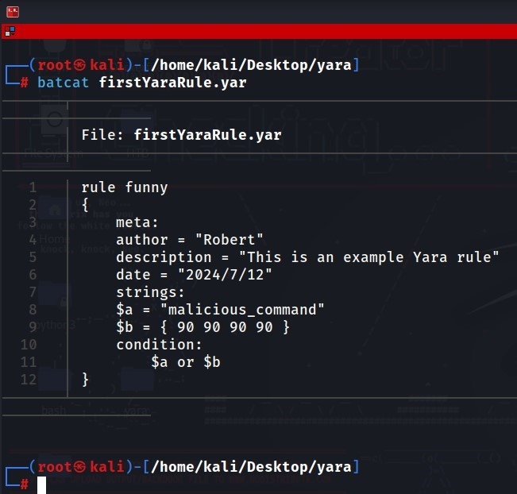
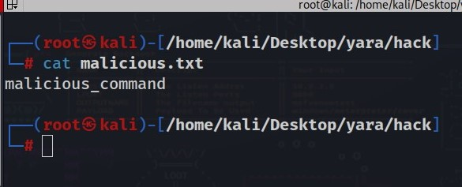
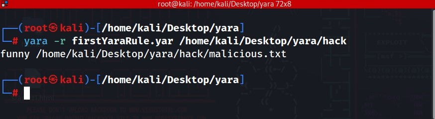

# Robert Chaves P. (r0b0t95)

## YARA
- ### oficial documentation: https://yara.readthedocs.io/en/latest/

### Introduction to YARA
*YARA is a tool aimed at helping malware researchers identify and classify malware samples. It allows users to create descriptions of malware families based on textual or binary patterns. These descriptions, known as YARA rules, enable the scanning and detection of malicious files*.

### Creating and Executing a YARA Rule
To illustrate the use of YARA, I created a YARA rule to detect a specific malicious script. Below is the example rule:



```bash
     # Yara rule in Linux
     rule funny
     {
          meta:
          author = "r0b0t95"
          description = "This is an example Yara rule"
          date = "2024/7/12"
          strings:
          $a = "malicious_command"
          $b = { 90 90 90 90}
          condition:
               $a or $b
     }
```

### Malicious text



### I executed this rule against a set of files, and it successfully detected the malicious script. Here is a screenshot showing the detection:



### Modifying the Malicious Script
To test the robustness of the YARA rule, I modified the malicious script by adding two different layers of obfuscation. The modified script now includes additional non-malicious code and encoded the original malicious content.


### Re-executing the YARA Rule
I re-executed the same YARA rule on the modified script. Unfortunately, the rule failed to detect the malicious content due to the added layers of obfuscation. Here is a screenshot showing the absence of detection:


## SNORT